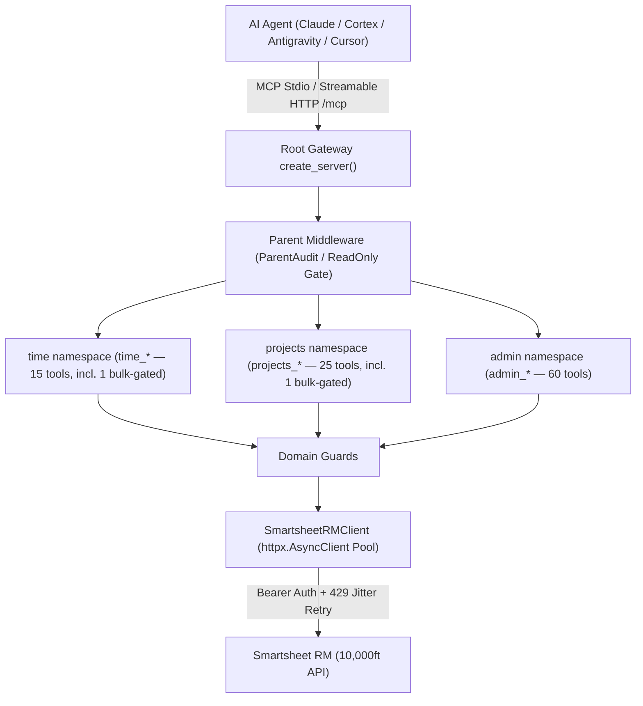

# 📋 mcp-server-smartsheet-rm

[](https://github.com/christianclaudio/mcp-server-smartsheet-rm/actions/workflows/ci.yml)
[](https://pypi.org/project/mcp-server-smartsheet-rm/)
[](https://pypi.org/project/mcp-server-smartsheet-rm/)
[](https://opensource.org/licenses/Apache-2.0)
[](https://github.com/christianclaudio/mcp-server-smartsheet-rm)
[](https://coderabbit.ai)

Enterprise Model Context Protocol (MCP) server for **Resource Management by Smartsheet** (10,000ft API).

Enables AI coding agents, planners, and assistants (Claude, Cortex, Antigravity, VS Code) to work with the Smartsheet RM public REST API: time tracking & timesheet reconciliation, resource scheduling & allocations, capacity planning, project & phase management, leaves/holidays, expense tracking, and custom fields.

---

## 🏗️ System Architecture



`create_server` mounts the time, projects, and admin sub-servers with FastMCP 4 `namespace=`, so `tools/list` names are `time_*`, `projects_*`, and `admin_*`. Legacy `rm_*` names are not registered on the gateway.

---

## 🚀 FastMCP 4 Server Composition

* **Domain mounts** (`root.mount(..., namespace=...)`):
  * `namespace="time"` → `time_*` (15 tools, including the bulk-gated `time_bulk_delete_time_entries`).
  * `namespace="projects"` → `projects_*` (25 tools, including the bulk-gated `projects_bulk_delete_assignments`).
  * `namespace="admin"` → `admin_*` (60 tools).
* **Hierarchical middleware**:
  * **Parent**: `ParentAuditMiddleware` (timing, lifecycle logs, secret redaction) and `ReadOnlyGateMiddleware` (annotation-driven read-only gate, see below).
  * **Child**: `TimeDomainGuardMiddleware` (logged hours must be 0–24; bulk gate), `ProjectsDomainGuardMiddleware` (project names must be non-empty; bulk gate), `AdminDomainGuardMiddleware` (`per_page` must be ≤ 1000).

### Profiles

Pick a profile with `--profile` or `SMARTSHEET_RM_PROFILE` (default `full`). An unknown profile name fails at startup with `ValueError`. There are two kinds:

* **Domain-mount profiles** mount whole domains: `full`, `time`, `projects`, `admin`, and `readonly`.
* **Job profiles** mount every domain, then expose only an explicit list of tool names for one job. Prompts and resources stay available on every job profile and on `readonly`; the domain-mount profiles `time`, `projects` and `admin` carry only their own domain's prompts and resources. Each listed name is checked against the full catalog when the server builds, so a typo fails at startup.

| Profile | Job it serves | Tools | With `SMARTSHEET_RM_READONLY=1` |
| :--- | :--- | ---: | ---: |
| `full` | Complete catalog, nothing omitted. Bulk tools are listed and refused at call time unless `SMARTSHEET_RM_ALLOW_BULK_DESTRUCTIVE=1`. Tool Search and Code Mode attach only here. | **100** | 39 |
| `time` | Time tracking, approvals and timesheet recipes (time domain). | **15** | 4 |
| `projects` | Projects, phases, assignments, placeholders and subtasks (projects domain). | **25** | 10 |
| `admin` | Users, org reference data, clients, expenses, fields, reports and webhooks (admin domain). | **60** | 25 |
| `readonly` | Inspect without side effects: every tool annotated `readOnlyHint=True`. | **39** | 39 |
| `timesheets` | Team member or manager logs, corrects, submits, locks and approves weekly time against their assignments. | **22** | 12 |
| `staffing` | Resource manager checks availability and utilization and creates or adjusts assignments, placeholders and subtasks. | **25** | 18 |
| `org_setup` | Resource-management admin onboards people and maintains org reference data, custom-field definitions, user statuses and webhooks. | **35** | 13 |
| `portfolio` | PMO sets up and maintains projects, phases, clients, expenses and project metadata, and reads budget and report totals. | **33** | 18 |

Seven tools are in no job profile and are reachable only in `full` (or their domain-mount profile): `time_bulk_delete_time_entries`, `projects_bulk_delete_assignments`, `admin_delete_client`, `admin_delete_client_contact`, `admin_create_expense_category`, `admin_delete_expense_category`, and `admin_delete_tag`.

### Read-only behavior

* The MCP `readOnlyHint` annotation is the only thing that decides whether a tool is read-only. Every tool declares it explicitly: `true` on the 39 reads and `false` on the 61 writes. A tool with no annotation or no `readOnlyHint` counts as a write.
* `--profile readonly` or `SMARTSHEET_RM_READONLY=1` (on any profile) lists only the read-only tools, and `ReadOnlyGateMiddleware` refuses any call to a real tool that is not read-only, including a write the filter hid. A refusal comes back as a tool result with `isError: true`.
* A name that is not a tool on the server gets FastMCP's normal `Unknown tool` error, directly or through `call_tool`, so a typo is never reported as a blocked tool.
* With Tool Search on, the gate checks the tool that `call_tool` wraps. Reads through `call_tool` work and writes are refused. Without Tool Search, `call_tool` is not a tool on the server, so a call to it gets `Unknown tool: 'call_tool'`.
* If the gate cannot see the serving server, it refuses the call.

### Bulk gate

`time_bulk_delete_time_entries` and `projects_bulk_delete_assignments` are listed in `full`, `time` and `projects`. The domain guards refuse them at call time (`isError: true`) unless `SMARTSHEET_RM_ALLOW_BULK_DESTRUCTIVE=1`, and the handlers still require `confirm=True`. Read-only mode hides and refuses them.

### Tool Search and Code Mode

`tools/list` is flat by default. Discovery is opt-in and attaches **only on `full`**:

* `--enable-tool-search` / `SMARTSHEET_RM_ENABLE_TOOL_SEARCH=1` replaces `tools/list` with `search_tools` and `call_tool`. The backend is `regex` (default) or `bm25` (`--tool-search-backend` / `SMARTSHEET_RM_TOOL_SEARCH_BACKEND`).
* `--enable-code-mode` / `SMARTSHEET_RM_ENABLE_CODE_MODE=1` attaches FastMCP's experimental Code Mode (`search`, `get_schema`, `execute`). Code Mode needs the `fastmcp[code-mode]` extra, which ships its `pydantic-monty` sandbox, for example `uvx --with "fastmcp[code-mode]" mcp-server-smartsheet-rm --enable-code-mode`. Without it, Code Mode is skipped with a warning and the flat catalog is served.
* Turning on both raises `ValueError`. Asking for either on another profile logs a warning and keeps the flat list.
* `search_tools`, `search` and `get_schema` only read the catalog and are annotated `readOnlyHint=True`. Under read-only, Code Mode `execute` is refused.

---

## ⚡ Tool Surface Overview

The server exposes tools covering projects, resources, timesheets, and capacity. Call the namespaced names below:
- **Default Registration**: 100 tools on `full` (the 2 bulk-destructive tools are listed and refused at call time unless `SMARTSHEET_RM_ALLOW_BULK_DESTRUCTIVE=1`).
- **Read-Only Mode**: 39 tools (`readOnlyHint=true`).
- **Destructive Gates**: 21 tools requiring explicit `confirm=True` (19 standard + 2 bulk).
- **Idempotent Operations**: 43 tools with `idempotentHint=true` (the 39 read-only tools, plus `time_update_time_approval_status`, `time_lock_timesheet`, `admin_set_custom_field_values`, and `admin_set_user_status`).

### Domain Overview
Agents call these `tools/list` names. Counts for time and projects include the bulk-gated tool.

1. **Time (`time_*`, 15 tools)**: `time_list_time_entries`, `time_get_time_entry`, `time_create_time_entry`, `time_update_time_entry`, `time_delete_time_entry`, `time_list_user_suggestions`, `time_update_time_approval_status`, `time_lock_timesheet`, `time_fill_weekly_timesheet`, `time_confirm_suggested_hours`, `time_reconcile_and_submit_week`, `time_list_approvals`, `time_create_approval`, `time_delete_approval`. Bulk-gated: `time_bulk_delete_time_entries`.
2. **Projects (`projects_*`, 25 tools)**: `projects_list_projects`, `projects_get_project`, `projects_create_project`, `projects_update_project`, `projects_delete_project`, `projects_list_project_users`, `projects_list_project_phases`, `projects_get_project_phase`, `projects_create_project_phase`, `projects_update_project_phase`, `projects_delete_project_phase`, `projects_list_assignments`, `projects_get_assignment`, `projects_create_assignment`, `projects_update_assignment`, `projects_delete_assignment`, `projects_clone_project_schedule`, `projects_list_status_options`, `projects_list_placeholder_resources`, `projects_create_placeholder_resource`, `projects_delete_placeholder_resource`, `projects_list_assignment_subtasks`, `projects_create_assignment_subtask`, `projects_delete_assignment_subtask`. Bulk-gated: `projects_bulk_delete_assignments`.
3. **Admin (`admin_*`, 60 tools)**:
   * Users, roles, disciplines, and capacity: `admin_list_users`, `admin_get_user`, `admin_create_user`, `admin_update_user`, `admin_delete_user`, `admin_list_user_bill_rates`, `admin_create_user_bill_rate`, `admin_get_user_availability`, `admin_get_user_utilization`, `admin_list_roles`, `admin_create_role`, `admin_update_role`, `admin_delete_role`, `admin_list_disciplines`, `admin_create_discipline`, `admin_update_discipline`, `admin_delete_discipline`.
   * Clients and contacts: `admin_list_clients`, `admin_get_client`, `admin_create_client`, `admin_update_client`, `admin_delete_client`, `admin_list_client_contacts`, `admin_create_client_contact`, `admin_delete_client_contact`.
   * Leaves and holidays: `admin_list_leave_types`, `admin_get_leave_type`, `admin_create_leave_type`, `admin_update_leave_type`, `admin_delete_leave_type`, `admin_list_holidays`, `admin_get_holiday`, `admin_create_holiday`, `admin_update_holiday`, `admin_delete_holiday`.
   * Expenses: `admin_list_expenses`, `admin_get_expense`, `admin_create_expense`, `admin_update_expense`, `admin_delete_expense`, `admin_list_expense_categories`, `admin_create_expense_category`, `admin_delete_expense_category`.
   * Tags and custom fields: `admin_list_tags`, `admin_create_tag`, `admin_delete_tag`, `admin_list_custom_fields`, `admin_get_custom_field`, `admin_create_custom_field`, `admin_update_custom_field`, `admin_delete_custom_field`, `admin_list_custom_field_values`, `admin_set_custom_field_values`.
   * Status, reports, and webhooks: `admin_get_user_statuses`, `admin_set_user_status`, `admin_get_report_rows`, `admin_get_report_totals`, `admin_list_webhooks`, `admin_create_webhook`, `admin_delete_webhook`.

---

## 🚀 Quickstart & Installation

### 1. Run via `uvx`

Console scripts in `[project.scripts]` both call `smartsheet_rm_mcp.server:main`: `smartsheet-rm-mcp` (used below) and `mcp-server-smartsheet-rm`. Install examples stay unpinned. To freeze a release, pin the version from [Releases](https://github.com/christianclaudio/mcp-server-smartsheet-rm/releases).

```bash
uvx --from mcp-server-smartsheet-rm smartsheet-rm-mcp
```

After an upgrade, reload the MCP host so the live process start time is after the new binary mtime (stale process ≠ new package).

### 2. Installation

```bash
# Using uv (recommended)
uv pip install mcp-server-smartsheet-rm

# Or standard pip
pip install mcp-server-smartsheet-rm
```

### 3. Environment Variables

| Variable | Description | Default |
| :--- | :--- | :--- |
| `SMARTSHEET_RM_API_TOKEN` | Smartsheet RM (10,000ft) API Token (**Required**) | - |
| `SMARTSHEET_RM_BASE_URL` | Base API URL | `https://api.rm.smartsheet.com/api/v1` |
| `SMARTSHEET_RM_PROFILE` | Profile: `full`, `time`, `projects`, `admin`, `readonly`, `timesheets`, `staffing`, `org_setup`, `portfolio` (see [Profiles](#profiles)) | `full` |
| `SMARTSHEET_RM_READONLY` | Set to `1` to list only `readOnlyHint=true` tools and refuse every other call | `0` |
| `SMARTSHEET_RM_ALLOW_BULK_DESTRUCTIVE` | Set to `1` to let the two listed bulk delete tools execute | `0` |
| `SMARTSHEET_RM_ENABLE_TOOL_SEARCH` | Set to `1` (or `--enable-tool-search`) for Tool Search on `full` | `0` |
| `SMARTSHEET_RM_TOOL_SEARCH_BACKEND` | Tool Search backend: `regex` or `bm25` (or `--tool-search-backend`) | `regex` |
| `SMARTSHEET_RM_ENABLE_CODE_MODE` | Set to `1` (or `--enable-code-mode`) for experimental Code Mode on `full`; not with Tool Search | `0` |
| `SMARTSHEET_RM_LOG_FORMAT` | Set to `json` for Datadog/CloudWatch structured logs | `text` |
| `SMARTSHEET_RM_ALLOWED_HOSTS` | Comma-separated hostnames allowed for base URL overrides. A non-blank value replaces the default. Loopback and private targets stay blocked. | `api.rm.smartsheet.com` |

---

## 💻 Client Configurations

### Google Antigravity (`~/.gemini/antigravity-cli/mcp_config.json`)

```json
{
  "mcpServers": {
    "smartsheet-rm": {
      "command": "uvx",
      "args": ["--from", "mcp-server-smartsheet-rm", "smartsheet-rm-mcp"],
      "env": {
        "SMARTSHEET_RM_API_TOKEN": "your-api-token"
      },
      "lazy": true
    }
  }
}
```

### Snowflake Cortex (`~/.snowflake/cortex/mcp.json`)

```json
{
  "servers": {
    "smartsheet-rm": {
      "command": "uvx",
      "args": ["--from", "mcp-server-smartsheet-rm", "smartsheet-rm-mcp"],
      "env": {
        "SMARTSHEET_RM_API_TOKEN": "your-api-token"
      }
    }
  }
}
```

### Claude Desktop (`claude_desktop_config.json`)

```json
{
  "mcpServers": {
    "smartsheet-rm": {
      "command": "uvx",
      "args": ["--from", "mcp-server-smartsheet-rm", "smartsheet-rm-mcp"],
      "env": {
        "SMARTSHEET_RM_API_TOKEN": "your-api-token"
      }
    }
  }
}
```

### Streamable HTTP

Prefer Streamable HTTP. `--transport sse` is deprecated (MCP spec SEP-2577); `main()` logs a migration warning and does not advertise `/sse` as the client path.

```bash
uvx --from mcp-server-smartsheet-rm smartsheet-rm-mcp --transport streamable-http --host 127.0.0.1 --port 8000
```

Connect clients to `http://127.0.0.1:8000/mcp` (FastMCP's default Streamable HTTP path). `run(transport="streamable-http")` does not set a custom path. Binding to `0.0.0.0` or `::` requires an explicit `--allowed-host` (a wildcard `*` is rejected).

---

## 🛡️ Safety & Reliability

- **Secret Redaction**: API tokens, bearer headers, and sensitive keys are automatically scrubbed from errors and logs.
- **Destructive Gates**: Every deletion tool declares `confirm: bool = False` and makes no change unless the caller explicitly passes `confirm=True`. Without it the tool returns a normal result (`isError: false`) with `"status": "confirmation_required"` and a message to re-call with `confirm=true`; that is the designed two-step, not an error.
- **Input Validation**: Missing or invalid arguments (for example an update with no fields, or a malformed date) return a tool error (`isError: true`, `"type": "invalid_request"`) the model can correct, as the MCP spec describes for input validation errors.
- **Batch Results**: `time_fill_weekly_timesheet`, `time_confirm_suggested_hours`, `time_bulk_delete_time_entries` and `projects_bulk_delete_assignments` share one shape: `"status": "success"` or `"partial_success"`, a success count (`filled_count` / `confirmed_count` / `deleted_count`), `failed_count`, `results` and `errors`. Each success is `{id|date, status, result}`; each failure is `{id|date, status: "failed", error}` where `error` always has a `message` (API errors via `to_dict()`; other exceptions as `"type": "internal"` with a redacted message). The field names from earlier releases stay alongside: `time_fill_weekly_timesheet` also returns `days_filled`, `created_count` and `entries` (the created entries), and `time_confirm_suggested_hours` returns `confirmed_entries`. When every item fails, the call is a tool error (`isError: true`, `"type": "batch_failed"`).
- **Profiles**: Minimize token footprint by loading only the tools one job needs (`timesheets`, `staffing`, `org_setup`, `portfolio`) or one domain (`time`, `projects`, `admin`).
- **Read-Only Gate**: `readOnlyHint` decides; anything else is refused with `isError: true`.
- **Resilience**: Exponential backoff with randomized jitter on HTTP 429 rate limits.

---

## 🧪 Testing & Validation

```bash
# Run tests with 100% coverage requirement
pytest --cov=src/smartsheet_rm_mcp --cov-fail-under=100 -v

# Run Tool Contract verification
python scripts/check_tool_contract.py

# Run OpenAPI Drift check
python scripts/check_openapi_drift.py
```

<!-- mcp-name: io.github.christianclaudio/smartsheet-rm -->
