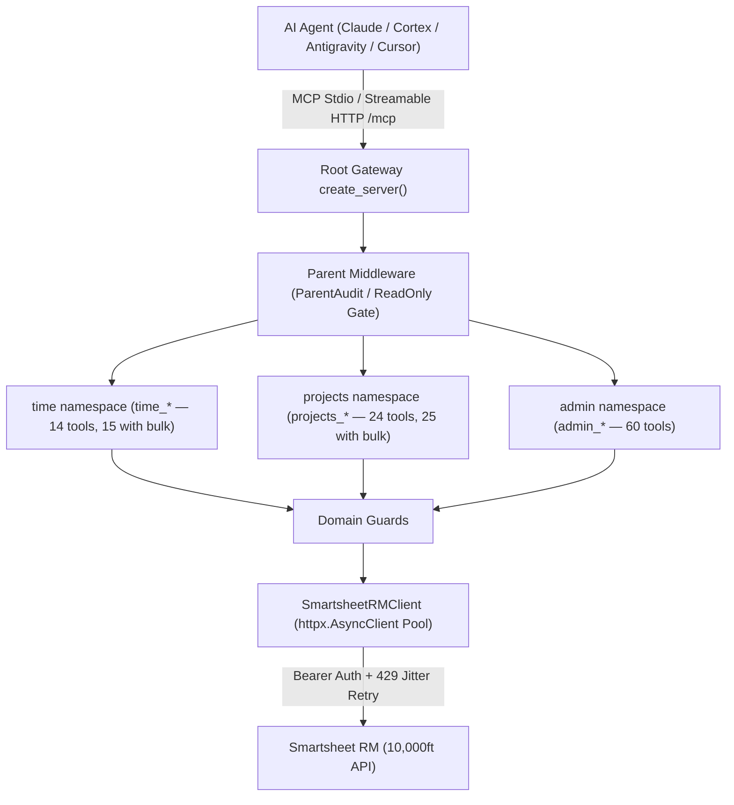

# 📋 mcp-server-smartsheet-rm

[](https://github.com/christianclaudio/mcp-server-smartsheet-rm/actions/workflows/ci.yml)
[](https://pypi.org/project/mcp-server-smartsheet-rm/)
[](https://pypi.org/project/mcp-server-smartsheet-rm/)
[](https://opensource.org/licenses/Apache-2.0)
[](https://github.com/christianclaudio/mcp-server-smartsheet-rm)
[](https://coderabbit.ai)

Enterprise Model Context Protocol (MCP) server for **Resource Management by Smartsheet** (10,000ft API).

Enables AI coding agents, planners, and assistants (Claude, Cortex, Antigravity, VS Code) to orchestrate the complete Smartsheet RM REST API surface: time tracking & timesheet reconciliation, resource scheduling & allocations, capacity planning, project & phase management, leaves/holidays, expense tracking, and custom fields.

---

## 🏗️ System Architecture



`create_server` mounts the time, projects, and admin sub-servers with FastMCP 4 `namespace=`, so `tools/list` names are `time_*`, `projects_*`, and `admin_*`. Legacy `rm_*` names are not registered on the gateway.

---

## 🚀 FastMCP 4 Server Composition

* **Domain mounts** (`root.mount(..., namespace=...)`):
  * `namespace="time"` → `time_*` (14 tools; 15 when bulk is enabled).
  * `namespace="projects"` → `projects_*` (24 tools; 25 when bulk is enabled).
  * `namespace="admin"` → `admin_*` (60 tools).
* **Hierarchical middleware**:
  * **Parent**: `ParentAuditMiddleware` (timing, lifecycle logs, secret redaction) and `ReadOnlyGateMiddleware` (fail-closed mutation block when `SMARTSHEET_RM_READONLY=1`).
  * **Child**: `TimeDomainGuardMiddleware` (logged hours must be 0–24), `ProjectsDomainGuardMiddleware` (project names must be non-empty), `AdminDomainGuardMiddleware` (`per_page` must be ≤ 1000).
* **Profiles** via `--profile` / `SMARTSHEET_RM_PROFILE` (`full`, `time`, `projects`, `admin`, `readonly`). Mounts are selective; read-only filtering and bulk gating run after mount:
  * `full` (default): time + projects + admin — **98** tools (**100** with bulk).
  * `time`: time sub-server only — **14** tools (**15** with bulk).
  * `projects`: projects sub-server only — **24** tools (**25** with bulk).
  * `admin`: admin sub-server only — **60** tools.
  * `readonly`: mounts all three domains, then drops every tool without `readOnlyHint` — **39** tools. `SMARTSHEET_RM_READONLY=1` applies that same filter on top of any profile.
* **Bulk gate**: `time_bulk_delete_time_entries` and `projects_bulk_delete_assignments` are registered only when `SMARTSHEET_RM_ALLOW_BULK_DESTRUCTIVE=1`. They stay absent in read-only mode.
* **Tool search**: flat `tools/list` by default. `--enable-tool-search` or `SMARTSHEET_RM_ENABLE_TOOL_SEARCH=1` adds `RegexSearchTransform`.

---

## ⚡ Tool Surface Overview

The server exposes tools covering projects, resources, timesheets, and capacity. Call the namespaced names below:
- **Default Registration**: 98 tools (with bulk-destructive operations gated by default).
- **With Bulk Operations**: 100 total tools when `SMARTSHEET_RM_ALLOW_BULK_DESTRUCTIVE=1`.
- **Read-Only Mode**: 39 tools (`readOnlyHint=true`).
- **Destructive Gates**: 21 tools requiring explicit `confirm=True` (19 standard + 2 bulk).
- **Idempotent Operations**: 43 tools with `idempotentHint=true` (the 39 read-only tools, plus `time_update_time_approval_status`, `time_lock_timesheet`, `admin_set_custom_field_values`, and `admin_set_user_status`).

### Domain Overview
Agents call these `tools/list` names. Counts for time and projects include the bulk-gated tool.

1. **Time (`time_*`, 15 tools)**: `time_list_time_entries`, `time_get_time_entry`, `time_create_time_entry`, `time_update_time_entry`, `time_delete_time_entry`, `time_list_user_suggestions`, `time_update_time_approval_status`, `time_lock_timesheet`, `time_fill_weekly_timesheet`, `time_confirm_suggested_hours`, `time_reconcile_and_submit_week`, `time_list_approvals`, `time_create_approval`, `time_delete_approval`. Bulk-gated: `time_bulk_delete_time_entries`.
2. **Projects (`projects_*`, 25 tools)**: `projects_list_projects`, `projects_get_project`, `projects_create_project`, `projects_update_project`, `projects_delete_project`, `projects_list_project_users`, `projects_list_project_phases`, `projects_get_project_phase`, `projects_create_project_phase`, `projects_update_project_phase`, `projects_delete_project_phase`, `projects_list_assignments`, `projects_get_assignment`, `projects_create_assignment`, `projects_update_assignment`, `projects_delete_assignment`, `projects_clone_project_schedule`, `projects_list_status_options`, `projects_list_placeholder_resources`, `projects_create_placeholder_resource`, `projects_delete_placeholder_resource`, `projects_list_assignment_subtasks`, `projects_create_assignment_subtask`, `projects_delete_assignment_subtask`. Bulk-gated: `projects_bulk_delete_assignments`.
3. **Admin (`admin_*`, 60 tools)**:
   * Users, roles, disciplines, and capacity: `admin_list_users`, `admin_get_user`, `admin_create_user`, `admin_update_user`, `admin_delete_user`, `admin_list_user_bill_rates`, `admin_create_user_bill_rate`, `admin_get_user_availability`, `admin_get_user_utilization`, `admin_list_roles`, `admin_create_role`, `admin_update_role`, `admin_delete_role`, `admin_list_disciplines`, `admin_create_discipline`, `admin_update_discipline`, `admin_delete_discipline`.
   * Clients and contacts: `admin_list_clients`, `admin_get_client`, `admin_create_client`, `admin_update_client`, `admin_delete_client`, `admin_list_client_contacts`, `admin_create_client_contact`, `admin_delete_client_contact`.
   * Leaves and holidays: `admin_list_leave_types`, `admin_get_leave_type`, `admin_create_leave_type`, `admin_update_leave_type`, `admin_delete_leave_type`, `admin_list_holidays`, `admin_get_holiday`, `admin_create_holiday`, `admin_update_holiday`, `admin_delete_holiday`.
   * Expenses: `admin_list_expenses`, `admin_get_expense`, `admin_create_expense`, `admin_update_expense`, `admin_delete_expense`, `admin_list_expense_categories`, `admin_create_expense_category`, `admin_delete_expense_category`.
   * Tags and custom fields: `admin_list_tags`, `admin_create_tag`, `admin_delete_tag`, `admin_list_custom_fields`, `admin_get_custom_field`, `admin_create_custom_field`, `admin_update_custom_field`, `admin_delete_custom_field`, `admin_list_custom_field_values`, `admin_set_custom_field_values`.
   * Status, reports, and webhooks: `admin_get_user_statuses`, `admin_set_user_status`, `admin_get_report_rows`, `admin_get_report_totals`, `admin_list_webhooks`, `admin_create_webhook`, `admin_delete_webhook`.

---

## 🚀 Quickstart & Installation

### 1. Run via `uvx` (pinned)

Console scripts in `[project.scripts]` both call `smartsheet_rm_mcp.server:main`: `smartsheet-rm-mcp` (used below) and `mcp-server-smartsheet-rm`. Pin the package and pass the script:

```bash
uvx --from mcp-server-smartsheet-rm==1.2.0 smartsheet-rm-mcp
```

After an upgrade, reload the MCP host so the live process start time is after the new binary mtime (stale process ≠ new package).

### 2. Installation

```bash
# Using uv (recommended)
uv pip install mcp-server-smartsheet-rm

# Or standard pip
pip install mcp-server-smartsheet-rm
```

### 3. Environment Variables

| Variable | Description | Default |
| :--- | :--- | :--- |
| `SMARTSHEET_RM_API_TOKEN` | Smartsheet RM (10,000ft) API Token (**Required**) | - |
| `SMARTSHEET_RM_BASE_URL` | Base API URL | `https://api.rm.smartsheet.com/api/v1` |
| `SMARTSHEET_RM_PROFILE` | Tool profile subset: `time`, `projects`, `admin`, `full`, `readonly` | `full` |
| `SMARTSHEET_RM_READONLY` | Set to `1` to restrict server to read-only tools | `0` |
| `SMARTSHEET_RM_ALLOW_BULK_DESTRUCTIVE` | Set to `1` to unlock bulk delete operations | `0` |
| `SMARTSHEET_RM_ENABLE_TOOL_SEARCH` | Set to `1` (or `--enable-tool-search`) for dynamic regex search | `0` |
| `SMARTSHEET_RM_LOG_FORMAT` | Set to `json` for Datadog/CloudWatch structured logs | `text` |
| `SMARTSHEET_RM_ALLOWED_HOSTS` | Comma-separated allowlist of hostnames for base URL overrides (mitigates SSRF/DNS-rebinding) | `unset` (allows valid HTTPS domains) |

---

## 💻 Client Configurations

### Google Antigravity (`~/.gemini/antigravity-cli/mcp_config.json`)

```json
{
  "mcpServers": {
    "smartsheet-rm": {
      "command": "uvx",
      "args": ["--from", "mcp-server-smartsheet-rm==1.2.0", "smartsheet-rm-mcp"],
      "env": {
        "SMARTSHEET_RM_API_TOKEN": "your-api-token"
      },
      "lazy": true
    }
  }
}
```

### Snowflake Cortex (`~/.snowflake/cortex/mcp.json`)

```json
{
  "servers": {
    "smartsheet-rm": {
      "command": "uvx",
      "args": ["--from", "mcp-server-smartsheet-rm==1.2.0", "smartsheet-rm-mcp"],
      "env": {
        "SMARTSHEET_RM_API_TOKEN": "your-api-token"
      }
    }
  }
}
```

### Claude Desktop (`claude_desktop_config.json`)

```json
{
  "mcpServers": {
    "smartsheet-rm": {
      "command": "uvx",
      "args": ["--from", "mcp-server-smartsheet-rm==1.2.0", "smartsheet-rm-mcp"],
      "env": {
        "SMARTSHEET_RM_API_TOKEN": "your-api-token"
      }
    }
  }
}
```

### Streamable HTTP

Prefer Streamable HTTP. `--transport sse` is deprecated (MCP spec SEP-2577); `main()` logs a migration warning and does not advertise `/sse` as the client path.

```bash
uvx --from mcp-server-smartsheet-rm==1.2.0 smartsheet-rm-mcp --transport streamable-http --host 127.0.0.1 --port 8000
```

Connect clients to `http://127.0.0.1:8000/mcp` (FastMCP's default Streamable HTTP path). `run(transport="streamable-http")` does not set a custom path. Binding to `0.0.0.0` or `::` requires an explicit `--allowed-host` (a wildcard `*` is rejected).

---

## 🛡️ Safety & Reliability

- **Secret Redaction**: API tokens, bearer headers, and sensitive keys are automatically scrubbed from errors and logs.
- **Destructive Gates**: Every deletion tool declares `confirm: bool = False` and rejects execution unless the caller explicitly passes `confirm=True`.
- **Profile Filtering**: Minimize token footprint by loading only relevant tool sets (`time`, `projects`, `admin`).
- **Resilience**: Exponential backoff with randomized jitter on HTTP 429 rate limits.

---

## 🧪 Testing & Validation

```bash
# Run tests with 100% coverage requirement
pytest --cov=src/smartsheet_rm_mcp --cov-fail-under=100 -v

# Run Tool Contract verification
python scripts/check_tool_contract.py

# Run OpenAPI Drift check
python scripts/check_openapi_drift.py
```

<!-- mcp-name: io.github.christianclaudio/smartsheet-rm -->
